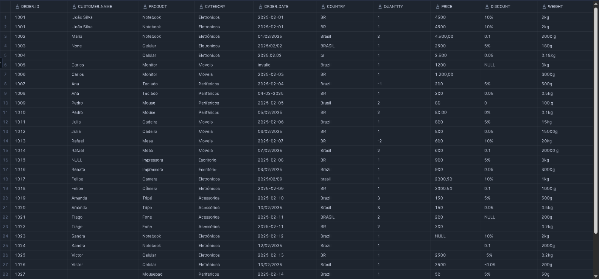
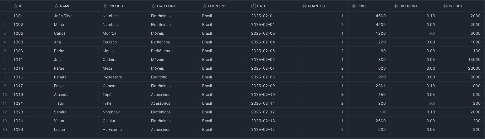

# Limpeza de Dados 2 - Dataset - 17-01-2026

---

## 🔹 Antes e Depois
Visualização do impacto da limpeza de dados na tabela bruta versus a tabela final padronizada.

### Tabela Bruta (Raw)

*Dados com formatações inconsistentes, duplicatas, valores nulos em texto e erros de digitação.*

### Tabela Final (Cleaned)

*Dados padronizados, tipagem corrigida, deduplicados via scoring e prontos para análise.*

---

## 🔹 Padrão de Limpeza de Dados Utilizado

Neste segundo projeto, a complexidade aumentou. Além das padronizações básicas, foi implementada uma lógica de **Scoring (Pontuação de Qualidade)** para decidir qual registro manter em caso de duplicidade parcial.

- O código completo da limpeza está disponível no repositório.

### 1. Entendimento da Base
- A base apresenta inconsistências mais severas de formatação de datas (uso de `/`, `.`, `-` e ordens invertidas).
- Preços e pesos misturam formatações brasileiras e americanas (`.` vs `,`).

### 2. Remoção Inicial
- Remoção de duplicatas exatas (`DISTINCT`).

### 3. Tratamento Avançado de Tipos
- Uso de `COALESCE` para tentar múltiplos formatos de data até encontrar o válido.
- Uso de `REGEXP` para identificar e corrigir padrões numéricos complexos em preços.

### 4. Lógica de "Melhor Linha" (Row Scoring)
- Criação de uma coluna de pontuação (`score`).
- Cada campo preenchido (não nulo) soma pontos.
- Em caso de conflito de dados (duplicatas parciais), o algoritmo preserva a linha com maior completude de informações.

---

## Inserção de Dados
*(Trecho resumido para visualização do problema)*
```sql
INSERT INTO treino_limpeza.raw.vendas_sujas2 VALUES
('1001',' João Silva ','Notebook','Eletronicos','2025-02-01','BR','1','4500','10%','2kg'),
('1002','Maria','Notebook','Eletrônicos','01/02/2025','Brasil','2','4.500,00','0.1','2000 g'),
('1005','Carlos','Monitor','Moveis','invalid','Brazil','1','1200','NULL','3kg'),
('1031','Bianca','Webcam','Perifericos','2025-02-16','BR','1','350','N/A','150g');
